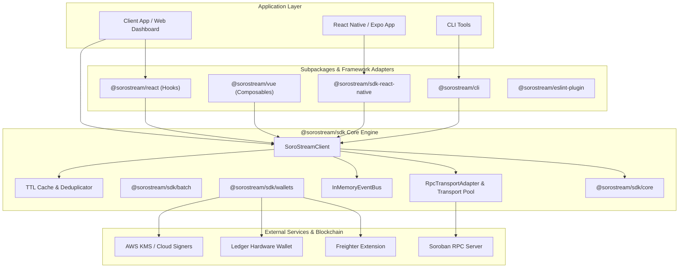

# SoroStream SDK Architecture

This document outlines the system architecture and module dependencies of `@sorostream/sdk`.

## Overview Architecture

## Modular Layering

1. **Client & Core Engine (`SoroStreamClient`, `src/core.ts`)**:
   Handles stream creation, top-up, cancellation, withdrawals, and balance estimations. Pure utility helpers (`toStroops`, `formatUSDC`, `claimableNow`, `calculateVestingSchedule`) are decoupled from network logic and can run in any JS environment (Node, Bun, Deno, Browser).

2. **Transport & Network Layer (`src/transport.ts`)**:
   Provides `RpcTransportAdapter`, `createDefaultRpcTransport`, and `createRetryingRpcTransport`. Abstracts all RPC interactions, JSON-RPC polling, and error handling.

3. **Event System (`src/eventBus.ts`, `src/events.ts`)**:
   Exposes `IEventBus` and `InMemoryEventBus` for streaming event notifications (`stream.created`, `stream.withdrawn`, `rpc.error`) without requiring global RxJS.

4. **Wallet Adapters (`src/wallet.ts`, `@sorostream/sdk/wallets`)**:
   Decouples transaction signing from stream management. Built-in adapters support Freighter (`createFreighterAdapter`), Ledger (`createLedgerAdapter`), Lobstr (`createLobstrAdapter`), Passkey, AWS KMS, and secret keypair.

5. **Storage & Audit Logging (`src/adapters.ts`)**:
   Provides `StorageAdapter` interface for audit logging across web (`localStorage`), React Native (`AsyncStorage`), and Expo (`expo-secure-store`).
