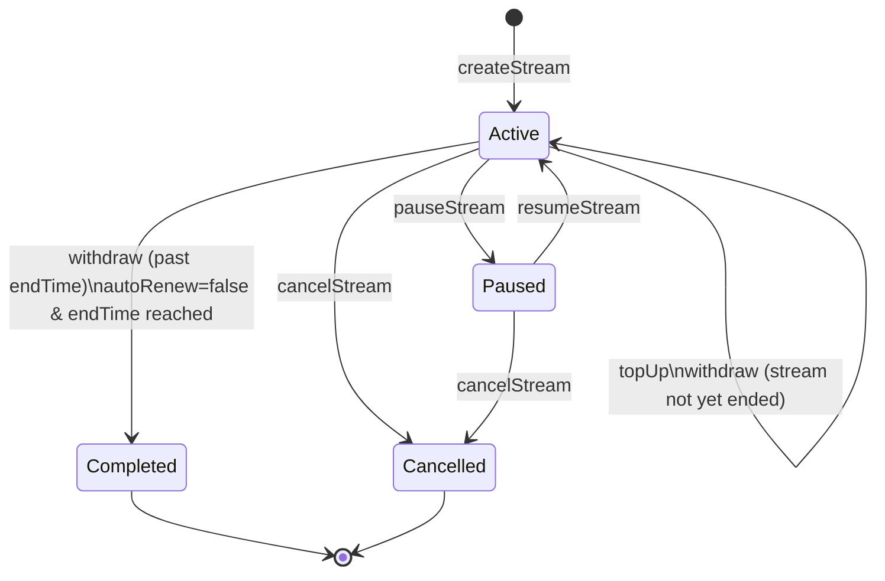

# Stream Lifecycle State Machine

Every SoroStream payment stream moves through a defined set of states. This document describes each state, the on-chain instructions that trigger transitions, and transitions that are explicitly invalid.

## State Diagram

## States

| State | Description |
|---|---|
| `Active` | Stream is running; tokens accrue to the recipient every second according to `flowRate`. |
| `Paused` | Stream clock is frozen; no tokens accrue. `pausedAt` records when the pause began. |
| `Completed` | All tokens have been fully disbursed. The stream is terminal. |
| `Cancelled` | Sender cancelled early; unstreamed remainder is refunded. The stream is terminal. |

## Transitions

| From | Instruction | To | Notes |
|---|---|---|---|
| — | `createStream` | `Active` | Stream is created with a `deposit`, `flowRate`, and `endTime`. |
| `Active` | `withdraw` (before `endTime`) | `Active` | Claimable tokens are sent to recipient; `lastWithdrawTime` is updated. |
| `Active` | `withdraw` (on/after `endTime`) | `Completed` | Final withdrawal; stream is sealed. |
| `Active` | `topUp` | `Active` | Extra tokens are added; `deposit` and `endTime` are extended proportionally. |
| `Active` | `pauseStream` | `Paused` | `pausedAt` is set; accrual stops. |
| `Active` | `cancelStream` | `Cancelled` | Remaining unstreamed deposit is returned to sender. |
| `Paused` | `resumeStream` | `Active` | `endTime` is extended by the paused duration; accrual resumes. |
| `Paused` | `cancelStream` | `Cancelled` | Remaining deposit is returned to sender. |

## Invalid Transitions

The contract rejects the following with `"Stream is not active"`:

| From | Instruction | Reason |
|---|---|---|
| `Cancelled` | `withdraw` | Terminal state — no tokens remain in the stream. |
| `Cancelled` | `cancelStream` | Cannot cancel an already-cancelled stream. |
| `Cancelled` | `topUp` | Cannot extend a cancelled stream. |
| `Cancelled` | `pauseStream` | Cannot pause a cancelled stream. |
| `Cancelled` | `resumeStream` | No paused stream to resume. |
| `Completed` | `withdraw` | Terminal state — all tokens already disbursed. |
| `Completed` | `cancelStream` | Cannot cancel a completed stream. |
| `Completed` | `topUp` | Cannot extend a completed stream. |
| `Completed` | `pauseStream` | Cannot pause a completed stream. |
| `Completed` | `resumeStream` | No paused stream to resume. |
| `Paused` | `withdraw` | Accrual is frozen; nothing has accumulated since pause. |

## Events Emitted Per Transition

| Instruction | Event emitted |
|---|---|
| `createStream` | `StreamCreated` |
| `withdraw` | `StreamWithdrawn` / `StreamCompleted` |
| `topUp` | `StreamToppedUp` |
| `pauseStream` | `StreamPaused` |
| `resumeStream` | `StreamResumed` |
| `cancelStream` | `StreamCancelled` |
| `transferStream` | `StreamTransferred` (recipient changes, state unchanged) |
